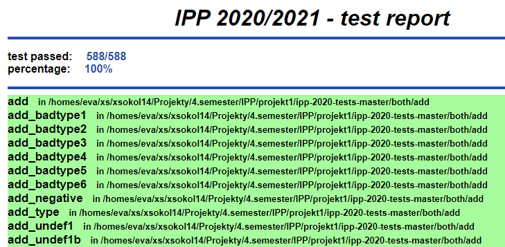

# Objektovo-orientované programovanie - projekt
---
### autor  
Jakub Sokolík

### popis  
Projekt rozdelený na 3 časti.
 1. **parser** - Prekladá jazyk IPP2021 do xml formátu. Implementácia v _php_.
 2.  **interpret** - Interpretuje kód jazyka IPP2021.
 3. **tester** - Testuje funkčnosť parseru a interpretu. Vytvára prehľadný report.

### Ukážka reportu

